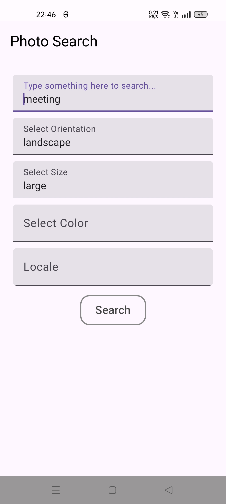

Search and show Photos on Pexels

Written in Kotlin and Jetpack Compose

Required to use (or build)
- Android Studio Meerkat | 2024.3.1 Patch 1
- Kotlin version : 2.0.21
- Dependencies :

    implementation ("androidx.datastore:datastore-preferences:1.0.0")

    implementation("com.google.accompanist:accompanist-swiperefresh:0.31.1-alpha")

    implementation ("androidx.compose.ui:ui:1.5.0")

    implementation ("androidx.compose.foundation:foundation:1.5.0")

    implementation ("androidx.compose.material:material:1.5.0")

    implementation ("androidx.lifecycle:lifecycle-runtime-compose:2.6.0")

    implementation ("androidx.activity:activity-compose:1.7.0")

    implementation ("com.squareup.picasso:picasso:2.8")

    implementation ("com.android.volley:volley:1.2.1")

    implementation ("com.google.code.gson:gson:2.8.9")

    implementation("io.coil-kt:coil-compose:2.4.0")

Core Functionality

● Users can search for images using the Pexels Search API.

● Search results will be displayed in a LazyVerticalGrid with "scroll to end to Load more".

● Use FAB (Floating Action Button) to Refresh (easier to use than pull-down-to-refresh).

● Clicking on an image should open a detail view of the image.

● Support for pinch-to-zoom and drag gestures

● Full Responsive/Adaptive layouts to support different screen sizes

● Support for search history or recent searches

📄 License
MIT License.

